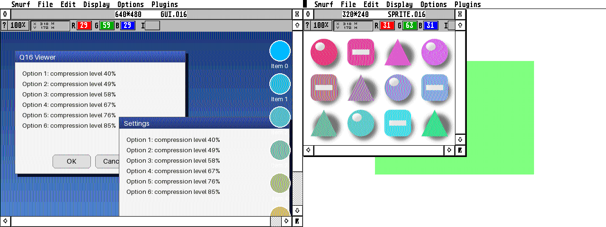

# Q16 modules for Smurf

[Smurf](https://github.com/th-otto/smurf) is a graphics editor for Atari
computers with import and export modules. `Q16.SIM` is an import module and
`Q16.SXM` an export module for Q16 pictures.

* Import decodes to 16-bit RGB565, Smurf's native True Color format, so no
  conversion is needed. Smurf has no alpha channel, so pictures with alpha
  are blended against white.
* Export saves 16-bit pictures as Q16 (without alpha). Smurf converts
  pictures of other depths to 16 bit before calling the module.
* Use q16_lib.c and are built for the 68000. The table-less pixel functions
  are used and q16_lib.c is compiled with `Q16_NO_STATIC_TABLE`, which leaves
  the table versions out.

There are two builds, since Smurf checks that a module was built with the
same compiler as itself (`MOD_INFO.compiler_id`): Pure C and gcc use
different calling conventions.

* `Q16.SIM`, `Q16.SXM`: for gcc builds of Smurf, such as the one built from
  the GitHub sources.
* `purec/Q16.SIM`, `purec/Q16.SXM`: for the original Smurf 1.06 binaries,
  which are built with Pure C. Same C code, also compiled with gcc, but with
  compiler id 0 and small assembler thunks: the entry point takes the
  `GARGAMEL` pointer in A0 and returns the result in D0 (import) or A0
  (export), and the calls to Smurf's `SMalloc()`/`SMfree()` pass their
  arguments in D0/A0 and protect D2, which Pure C functions may destroy but
  gcc expects to be preserved.
  The Smurf structures have the same layout with both compilers, since they
  use fixed size types.

## Installing

Copy `Q16.SIM` into `modules\import` and `Q16.SXM` into `modules\export` in
Smurf's folder. Take them from `purec` for the original Smurf 1.06.

## Building

    ./build.sh [smurf source directory] [vasm executable]

needs m68k-atari-mint-gcc
([Vincent Rivière's PPA](https://launchpad.net/~vriviere/+archive/ubuntu/ppa))
and [vasm](http://sun.hasenbraten.de/vasm/) for the startup code
(`impstart.s`, `expstart.s`). Six headers from Smurf are downloaded from
GitHub unless a Smurf source tree is given.

## Testing

`test/smurftst.c` loads the modules the same way Smurf does (`Pexec()` mode 3,
module header at the start of the TEXT segment, `start_module()`) and calls
them with a minimal `GARGAMEL` structure: the import module with a Q16 file,
the export module with the imported pixels and Smurf's message sequence
(`MEXTEND`, `MCOLSYS`, `MSTART`, `MEXEC`, `MTERM`). It reads the file names
from `SMURFTST.CFG`.

`test/SMURFTPC.TOS` is the same program calling the modules like a Pure C
Smurf (`test/pccall.s`): `GARGAMEL` pointer in A0, Pure C service functions
that take their arguments in registers and destroy D1/D2/A1.

Tested in Hatari (Falcon, EmuTOS), with both builds: imported pixels match a
reference decoder for pictures with and without alpha, a picture without
alpha exports to a byte-identical file, and the Pure C build gives the same
output as the gcc build. The Pure C build hasn't been tried in a real Pure C
Smurf 1.06, since no copy of that binary could be found.

The gcc build was also tried in the real Smurf, built from the GitHub
sources (`dist/smurf.prg`), in Hatari (Falcon, EmuTOS, 640x480 in 256
colours): Smurf lists Q16 among its import formats and loads and displays
Q16 pictures given on its command line.

That Smurf build crashes as soon as it displays any picture, whatever the
format, because of a bug in Smurf itself: several of its `.s` files use
`#ifndef __MSHORT__` but are assembled without the C preprocessor, so the
code for 16-bit int is assembled after the code for 32-bit int and wins.
`test/fixsmurf.py` patches the binaries (smurf.prg and the modules) by
replacing the wrong variant with NOPs; the real fix is to preprocess those
files (rename them to `.S` or assemble with `-x assembler-with-cpp`).
On first start Smurf also spends a very long time in emulation building its
nearest colour table (`smp.8` for 256 colours); providing a precomputed one
skips that.
